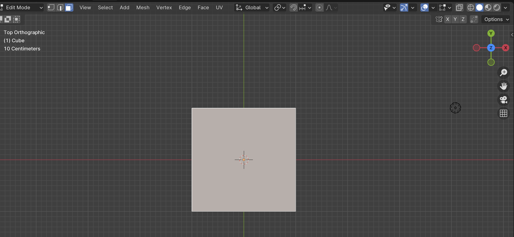
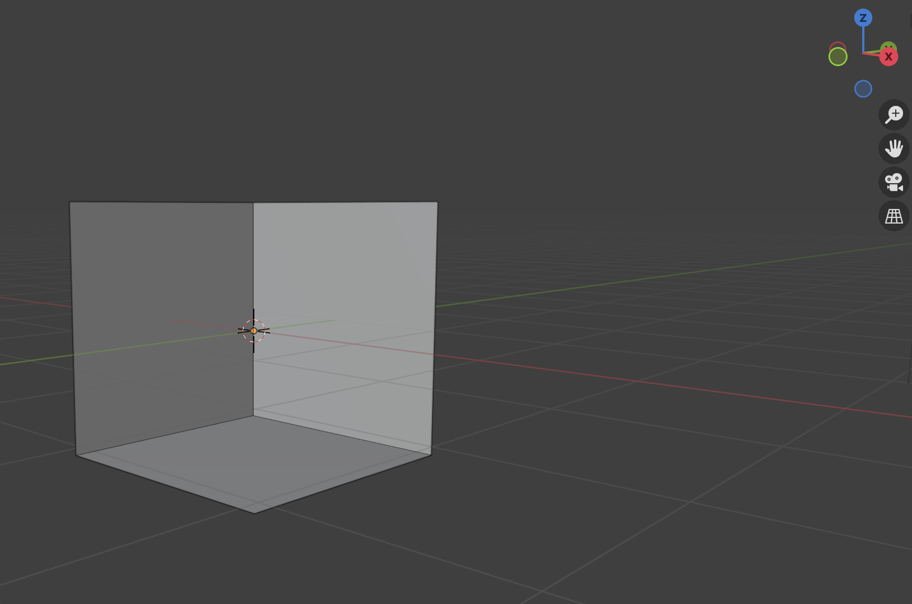
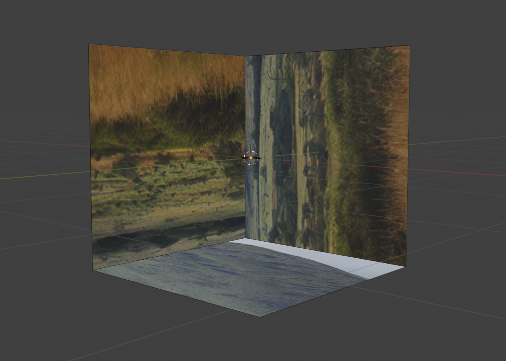
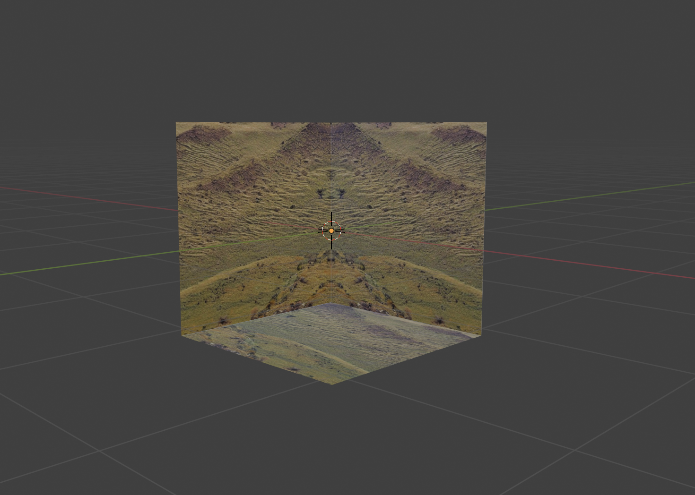

# Creating a Simple Background in Blender

TODO: Add link to yt tutorials

You can download Blender from [here](https://www.blender.org/download/).

When you open a new project in Blender, you automatically start with a default cube. We will create the background by editing the cube.

### Remove faces

- Tab or select Edit Mode
- Select Faces
- Select the face (s) you want to delete Z, X, -Y

Tip - if you hit the blue circle, the view will change and the face pointing in the +Z direction will be facing you.

- Select the face by clicking on it (the border will be white)

- Right click, and then choose Delete Faces

- Repeat for the X and -Y faces

You should get an open cube that looks like this:

### Flip Normals

- This is necessary so that the image is added correctly

- Select all -> Mesh -> Normals -> Flip

### Edit UVs

- Select All -> UV -> Unwrap
- Select All -> UV -> Smart UV Project -> OK

### Add an Image

- Tab or click on Object Mode
- Click on Material Icon in bottom right corner
- Click on yellow button (Material Color)
- Choose Image texture (second column)
- Click on icon that looks like a file cabinet and choose the image you want to use as a texture

You won't see your image yet. You need to swtich to viewport shading by clicking on the icon in upper right corner. You will then see your image applied to the cube. The problem is that the image was applied like we want it to be applied.

It was a little tricky getting the image(s) to project the correct way into the cube, so I created a p5.js sketch to use as a template:

[Background template](https://editor.p5js.org/kfahn/sketches/qjBEbk-my).

